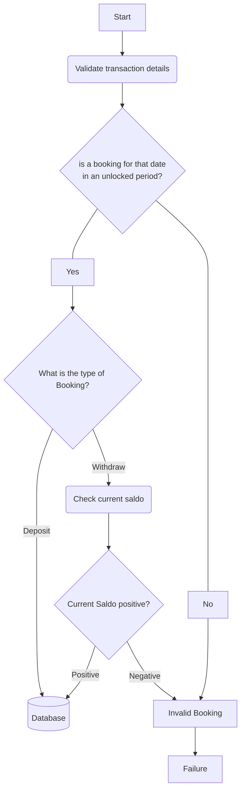
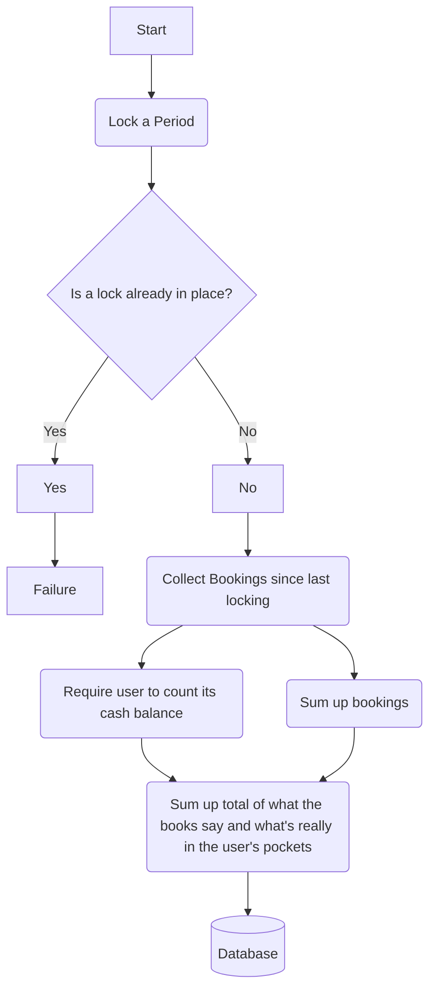
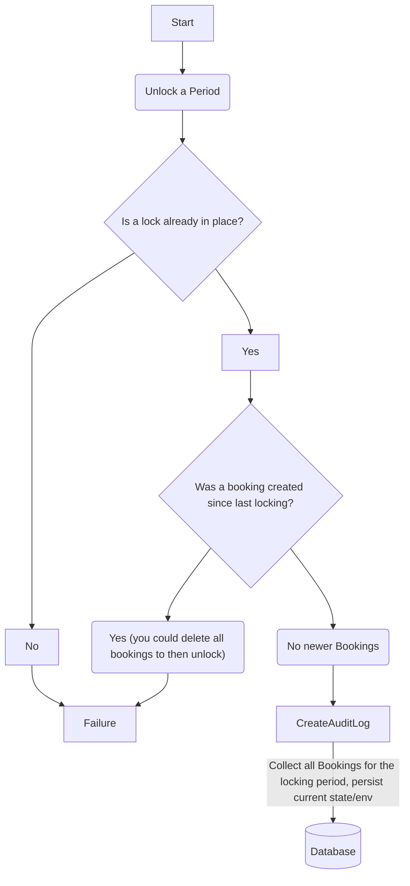

# ka-ching-backend<!-- omit in toc -->

The much-sought-after yet elusive cash register system is now finally available as a micro-monolith.

[](https://github.com/simonneutert/ka-ching-backend/actions/workflows/ruby.yml)

### Check out the demo<!-- omit in toc -->

Don't wanna read all the texts below?  
You want to be inspired and see for yourseld how ka-ching-backend and ka-ching-client (both in Ruby) could be used in a real world project?

➡️ Visit [ka-ching-demo](https://github.com/simonneutert/ka-ching-demo) and fire up that `docker-compose` 🐳🔥  
it's still WIP, but you will get to use most of the features by now already! 💪 🫨

### Quotes to live by (and die for)<!-- omit in toc -->

> "Credit card goes brrrrrrr,  
> but real money goes ka-ching!"
>
> _\- Lambda Ferrari_

AND ALSO

> "Money can't buy happiness, but it's a lot more comfortable to cry in a Mercedes than on a bicycle."
>
> _\- John Doe_

---

## Highlight Features<!-- omit in toc -->

- multi-tenant database architecture
- relies on database locks for critical operations
- json columns in most tables, to pass your own context
- fast, cheap, and reliable
- short and concise codebase
- lean on dependencies
- with containerization in mind

## API V1<!-- omit in toc -->

To learn how to create tenant databases, create bookings, create lockings, and access audit logs, please read the API V1 documentation [here](http://localhost:9292/docs/api/v1/index.html) after a good old `$ rackup`.

Alternatively, when having Node.js installed, you can also run the following command to start a local server that serves the API V1 documentation:

```sh
$ npx http-server -p 9292
# open browser at http://localhost:9292/docs/api/v1/index.html
```

Checkout the Client, too 🦄  
You can find it on GitHub: [ka-ching-client](https://github.com/simonneutert/ka-ching-client).

---

- [Quickstart for local testing/development](#quickstart-for-local-testingdevelopment)
- [Quickstart for local experiments with Docker](#quickstart-for-local-experiments-with-docker)
- [What this repo is](#what-this-repo-is)
  - [What it is not](#what-it-is-not)
  - [Rationale](#rationale)
    - [Micro-Monolith, wtf?](#micro-monolith-wtf)
- [Setup and Dependencies](#setup-and-dependencies)
  - [Configuration via Environment Variables](#configuration-via-environment-variables)
    - [Global Database Settings](#global-database-settings)
    - [Sequel Connection](#sequel-connection)
    - [Project specific Database Settings](#project-specific-database-settings)
    - [Project specific Settings](#project-specific-settings)
    - [Puma Settings (for production)](#puma-settings-for-production)
- [Database Setup (the initial setup)](#database-setup-the-initial-setup)
- [Run](#run)
  - [Run development](#run-development)
  - [Run the tests](#run-the-tests)
  - [Run production](#run-production)
    - [Optional: use jemalloc2 for garbage collection](#optional-use-jemalloc2-for-garbage-collection)
    - [Postgres Tuning Tools](#postgres-tuning-tools)
- [Abstractions](#abstractions)
  - [Bookings](#bookings)
  - [Lockings](#lockings)
  - [Auditlogs](#auditlogs)
- [Diagrams](#diagrams)
  - [Booking a Deposit/Withdraw](#booking-a-depositwithdraw)
  - [Locking a period](#locking-a-period)
  - [Unlocking a period](#unlocking-a-period)
- [Code of Conduct](#code-of-conduct)
- [Contributing](#contributing)
  - [Table of Contents - How to update with VSCode](#table-of-contents---how-to-update-with-vscode)
  - [Minitest](#minitest)
    - [Run a single test](#run-a-single-test)
- [Todos](#todos)

---

## Quickstart for local testing/development

you need a default postgres instance running or configure the connection via environment variables.

1. clone the repo
2. create the databases

```sh
$ bin/setup
```

3. run the tests

```sh
$ bundle install && rake
```

4. start the server

```sh
$ rackup
```

_from another terminal, while the server is running_

5. create a sample tenant

```sh
$ http POST ':9292/ka-ching/api/v1/admin' \
    tenant_account_id=testuser_1
```

6. create a sample booking with value of 100 cents

```sh
$ http POST ':9292/ka-ching/api/v1/testuser_1/bookings' \
    action="deposit" \
    amount_cents:=100 \
    year:=2023 \
    month:=1 \
    day:=1 \
    'context[foo]="bar"'
```

7. create a sample withdrawal with value of 100 cents

```sh
$ http POST ':9292/ka-ching/api/v1/testuser_1/bookings' \
    action="withdrawal" \
    amount_cents:=100 \
    year:=2023 \
    month:=1 \
    day:=1 \
    'context[foo]="bar"'
```

8. create a sample locking

```sh
$ http POST ':9292/ka-ching/api/v1/testuser_1/lockings' \
    action="lock" \
    amount_cents_saldo_user_counted:=100 \
    year:=2023 \
    month:=1 \
    day:=1 \
    'context[foo]="bar"'
```

9. create a sample unlocking

```sh
$ http DELETE ':9292/ka-ching/api/v1/testuser_1/lockings'
```

10. check auditlogs

```sh
$ http ':9292/ka-ching/api/v1/testuser_1/auditlogs/2023'
```

I recommend digging into the [API V1 documentation](public/docs/api/v1/Readme.md) to learn more about the whole feature set of the API.

---

## Quickstart for local experiments with Docker

1. clone the repo
2. in terminal "A" `$ docker-compose up`
3. in terminal "B" `$ docker-compose exec -ti api bin/setup`
4. stop the server in terminal "A" with `Ctrl+C`
5. `$ docker-compose up` and run call against the API (see above)

---

## What this repo is

A fully functional multi-tenant REST-API application that acts as an abstraction layer for register cash transactions.

This aims to be an uncomplicated and effortless tool for you to track/book cash register transactions, designed with a multitenant database in mind.  
Small footprint, user-friendly REST-API.  
Easy to incorporate it into your infrastructure as a service, secured via firewalls and proxies on infrastructure level.

### What it is not

This application does not include a frontend or authentication capabilities. It is not designed to be your standalone backend system.

### Rationale

When deciding to implement a micro-monolith for accounting or booking logic, it is important to consider separation of concerns, adherence to SOLID principles, and keeping the main service's code base clean. The following arguments support these principles:

1. Separation of Concerns: Implementing accounting or booking logic in a separate service helps to reduce complexity and ensure that each service has a single responsibility. This separation of concerns makes it easier to maintain the application and to make changes to the logic without affecting other parts of the system.

2. SOLID Principles: Implementing accounting or booking logic as a micro-monolith encourages adherence to the SOLID principles of object-oriented programming, particularly the Single Responsibility Principle (SRP) and the Interface Segregation Principle (ISP). This ensures that each product has a clear responsibility and that it interacts with other services through well-defined interfaces.

3. Easier Testing: Implementing accounting or booking logic as a micro-monolith makes it easier to test this functionality in isolation, without the need to test the entire application. This approach makes it easier to write comprehensive tests that cover all aspects of the functionality and ensures that any bugs are caught early in the development cycle.

4. Maintainability: Implementing accounting or booking logic as a micro-monolith makes it easier to maintain the application over time, as changes to the logic can be made independently of other parts of the system. This approach reduces the risk of introducing bugs or breaking existing functionality when making changes.

5. Flexibility: Implementing the cash booking logic as a product of its own allows to tune or version the API independently of the main service. This approach makes it easier to make changes to the API without affecting the main service, and it allows to implement new features without breaking existing functionality.

This project aims to provide a simple and easy to use REST-API for cash register transactions. By providing JSON columns for storing arbitrary data, it is possible to extend the API with custom fields and data structures.

#### Micro-Monolith, wtf?

I've been tossing around the term "micro-monolith" for some time. Not sure if it's officially recognized, but I dig it. It's a compact monolith that can effortlessly serve as a foundation for something larger or function independently. As a micro-monolith, it's indivisible. It's a monolith, just pint-sized.

## Setup and Dependencies

- Ruby 3.x (but 3.2.x is recommended) with the following gems:
  - [Roda](https://roda.jeremyevans.net/)
  - [Sequel](https://sequel.jeremyevans.net/)
  - [Rake](https://github.com/ruby/rake)
  - [MiniTest](http://docs.seattlerb.org/minitest/)
- Postgres

### Configuration via Environment Variables

The following environment variables are used to configure the application:

#### Global Database Settings

[Sequel](https://sequel.jeremyevans.net) is used to connect to the database. The following environment variables are used to configure the connection:

- `DATABASE_USER`  
  the database user, defaults to: `postgres`
- `DATABASE_PASSWORD`  
  the database password, defaults to: `postgres`
- `DATABASE_URL`  
  the database url, defaults to: `localhost`
- `DATASBASE_PORT`  
  the database port, defaults to: `5432`

#### Sequel Connection

The connection to the database is established using Sequel's connection string format ([see details here](https://sequel.jeremyevans.net/rdoc/files/doc/opening_databases_rdoc.html)).

`"postgres://#{DATABASE_URL}:#{DATABASE_PORT}/#{database}?user=#{DATABASE_USER}&password=#{DATABASE_PASSWORD}"`

This project relies on database locking and how it works specifically in PostgreSQL. As a result, the implementation of this program is limited to using PostgreSQL.

#### Project specific Database Settings

- `DATABASE_TENANT_DATABASE_NAMESPACE` - the database namespace, defaults to: `kaching`
- `DATABASE_NAME_SHARED` - the database name, defaults to: `kaching_shared`
- `DATABASE_NAME_BLANK` - the database name, defaults to: `"#{DATABASE_TENANT_DATABASE_NAMESPACE}blank"`

#### Project specific Settings

- `RACK_ENV` - the environment, defaults to: `development`
- `KACHING_RESET_PROTECTION` - the demo mode, defaults to: `false`, if set to `true`, the application will allow resets of a tenant's data

#### Puma Settings (for production)

- `WEB_CONCURRENCY` - the number of puma workers, defaults to: `2`
- `WEB_MAX_THREADS` - the number of max puma threads, defaults to: `2`
- `WEB_MIN_THREADS` - the number of min puma threads, defaults to: `1`

## Database Setup (the initial setup)

- Setup databases via `$ bin/setup`
- check `Rakefile`

## Run

### Run development

Make sure you have the described environment variables set or match the defaults described above.

- `$ bin/setup`
- `$ bundle install`
- `$ bundle exec rackup`

### Run the tests

1. drop all databases for the current environment (kaching\_\*) and/or whatever you have set in `DATABASE_TENANT_DATABASE_NAMESPACE`
2. `$ bin/setup`
3. `$ bundle exec rake test`

### Run production

Make sure you have the described environment variables set or match the defaults described above.

#### Optional: use jemalloc2 for garbage collection

Add this environment variable

`LD_PRELOAD=/usr/lib/x86_64-linux-gnu/libjemalloc.so.2`

to your Docker startup script (that might be a customized docker-compose.yml). 

The part regarding the architecture might be different on your machine. `x86_64-linux-gnu` should be replaced with `aarch64-linux-gnu` on an M1 Mac.

As an example:

<details><summary>Toggle me!</summary>

```yml
version: '3.1'

services:
  db:
    image: postgres:alpine
    restart: always
    environment:
      POSTGRES_USER: kaching
      POSTGRES_PASSWORD: kaching
      LC_ALL: C.UTF-8
      LANG: en_US.UTF-8

  api:
    image: ghcr.io/simonneutert/ka-ching-backend:main
    # build:
    #   context: .
    #   dockerfile: Dockerfile
    restart: always
    environment:
      - DATABASE_URL=db
      - DATABASE_USER=kaching
      - DATABASE_PASSWORD=kaching
      # - RACK_ENV=development
      - KACHING_RESET_PROTECTION=false
      - LD_PRELOAD=/usr/lib/x86_64-linux-gnu/libjemalloc.so.2 # Your architecture (x86_64-linux-gnu) might be different on an M1 Mac it would be aarch64-linux-gnu
    depends_on:
      - db
    ports:
      - 9292:9292
    expose:
      - 9292
```

</details>


#### Postgres Tuning Tools

- [Postgres Wiki](https://wiki.postgresql.org/wiki/Tuning_Your_PostgreSQL_Server) on Performance Optimization.
- [dbForge Studio](https://www.devart.com/dbforge/postgresql/studio/query-profiler.html) for PostgreSQL helps to identify productivity bottlenecks, and provides PostgreSQL performance tuning.
- The [postgresqltuner.pl script on GitHub](https://github.com/jfcoz/postgresqltuner) can analyze the configuration and make tuning recommendations.
- [PgBadger](https://pgbadger.darold.net) analyse PostgreSQL logs to generate performance reports.
- [pgMustard](https://www.pgmustard.com) provides tuning advice based on EXPLAIN ANALYZE output.

## Abstractions

Currently, no ORM is used. The database is accessed directly via Sequel, and services are implemented as a set of classes. This approach aims to ensure that the logic of the application is not tightly coupled to models (and their behaviour), but is rather based on tasks. Some critical tasks need to be backed by a database/table lock, in a multitenant it was more expressive this way.

### Bookings

- `bookings` - a booking is a transaction that is booked in the database

### Lockings

- A `locking` is a collection of bookings that are locked in the database for a period of time.
- `Unlocking a locking`: This action deactivates a locking and unlocks all bookings related to the locking. An entry will be created in the `audit_logs` table. You should make an effort to guide your users so that this action is run as seldom as possible.

### Auditlogs

- An `audit_logs` is a log entry in the database of certain actions and their state, such as unlocking a locking.

## Diagrams

The two main flows of the application are described in the following diagrams.

They aren't meant to be a complete description of the application, but rather to give an overview of the main flows.

### Booking a Deposit/Withdraw



### Locking a period



### Unlocking a period



## Code of Conduct

There are a few simple rules to follow when using this tool.

- be nice
- be patient

## Contributing

see [CONTRIBUTING.md](CONTRIBUTING.md)

**How to contribute** tldr

- Fork the repo
- Create a new branch
- Make your changes
- Write tests
- Make sure all tests pass
- Make sure your code is formatted with `rubocop`
- Make sure your code (the public parts) is documented with `yard`
- Make sure to add an entry to the [CHANGELOG.md](CHANGELOG.md)
- Update the documentation if necessary ([README.md](Readme.md) (with its [ToC](#table-of-contents---how-to-update-with-vscode)), etc.)
- Create a pull request
- Wait for the CI to run
- Wait for a review
- :tada: :tada: :tada:

### Table of Contents - How to update with VSCode

I use Visual Studio Code with this extension: https://markdown-all-in-one.github.io/docs/guide/table-of-contents.html#creating-a-toc

Maybe you should, too?

### Minitest

Our test suite is written with [Minitest](http://docs.seattlerb.org/minitest/).

#### Run a single test

`ruby -w -Ilib:test test/api/v1/integration/bookings_test.rb --name test_no_negative_saldo_in_between`

## Todos

- [ ] add tests for rake tasks, like db:drop, db:create, db:migrate, db:seed
- [ ] provide a SPA (demo repository) (made with sth lightweight and evergreen like [HTMX](https://htmx.org/) 🥰 or [Stimulus](https://stimulus.hotwire.dev/) or even [Preact](https://preactjs.com/)?)
